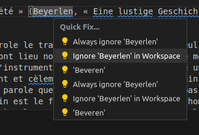

# Paume une thèse a porté de main

## Local LanguageTool linting

### Installation

#### Docker

Base on that (documentation)[https://docs.docker.com/engine/install/ubuntu/]

Clean docker env if necessary.

```zsh
$ for pkg in docker.io docker-doc docker-compose docker-compose-v2 podman-docker containerd runc; do sudo apt-get remove $pkg; done
```

Set up Docker's apt repository.

```zsh
# Add Docker's official GPG key:
sudo apt-get update
sudo apt-get install ca-certificates curl gnupg
sudo install -m 0755 -d /etc/apt/keyrings
curl -fsSL https://download.docker.com/linux/ubuntu/gpg | sudo gpg --dearmor -o /etc/apt/keyrings/docker.gpg
sudo chmod a+r /etc/apt/keyrings/docker.gpg

# Add the repository to Apt sources:
echo \
  "deb [arch="$(dpkg --print-architecture)" signed-by=/etc/apt/keyrings/docker.gpg] https://download.docker.com/linux/ubuntu \
  "$(. /etc/os-release && echo "$VERSION_CODENAME")" stable" | \
  sudo tee /etc/apt/sources.list.d/docker.list > /dev/null
sudo apt-get update
```

To install the latest version, run:

```zsh
sudo apt-get install docker-ce docker-ce-cli containerd.io docker-buildx-plugin docker-compose-plugin
```

Verify your installation

```
sudo docker run hello-world
```

#### Install extension

Base on that (documentation)[https://marketplace.visualstudio.com/items?itemName=davidlday.languagetool-linter]

Do `ctrl + p` then paste:

```shell
ext install davidlday.languagetool-linter
```

### Use LanguageTool docker image

#### Start/Stop a local server

In an external terminal, run:

```shell
sudo docker run --rm --name spellchecker -p 8081:8010 silviof/docker-languagetool # first time is long since you download the image of the container
```

When you are done or your computer is slow because the CPU burning in another external terminal, use this command to stop this spellchecker 

```shell
sudo docker container stop spellchecker
```

#### Usage in VScodium with shortcuts (so fast)

Open an `.md` file:

To jump press `f8` (or `fn + f8` if you remap your keyboard in the dum way (sorry, the "not professional" user friendly way)) 

To jump backward use press `shift + f8` (or `shift + fn + f8`) 

To take an action/ correct under the cursor press `ctrl + .`

> Note: that we were ignoring words in the workspace 




